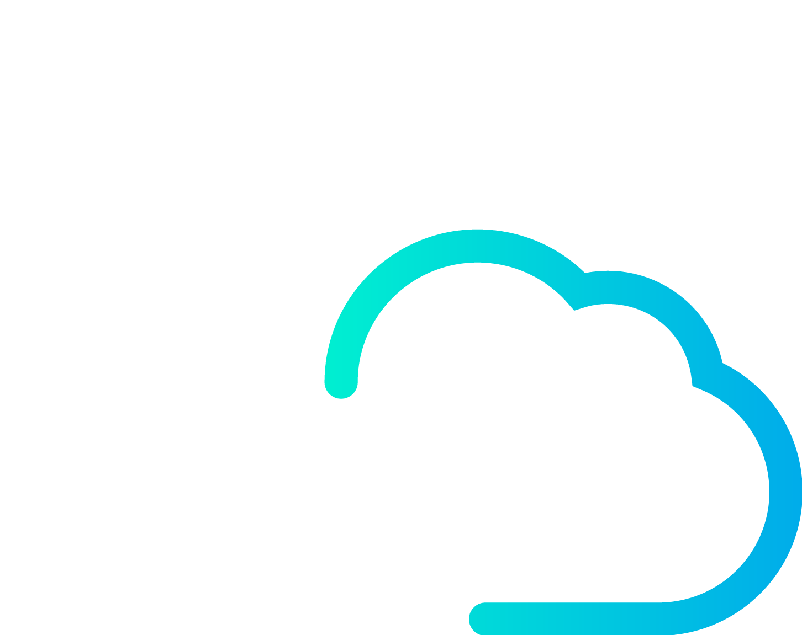
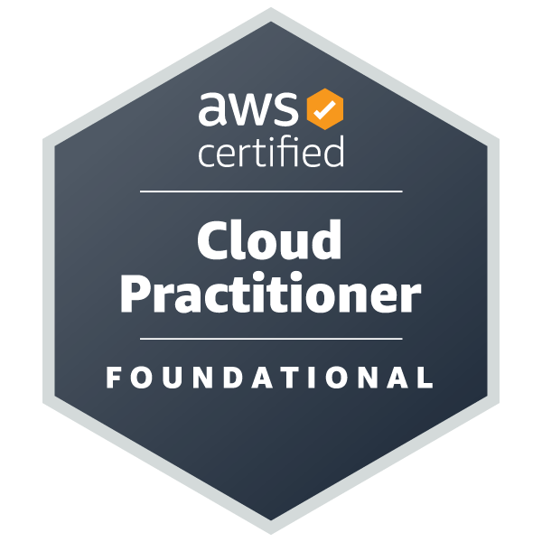

  

    <a href="https://www.linkedin.com/in/lucas-s%C3%A1-140a66368/" target="_blank">
      <picture>
        <source media="(prefers-color-scheme: dark)" srcset="./img/header-dark.svg?v=20">
        
      </picture>
    </a>
  

  <picture>
    <source media="(prefers-color-scheme: dark)" srcset="https://readme-typing-svg.herokuapp.com?font=Fira+Code&weight=600&size=24&pause=1000&color=ffffff&background=0d1117&center=true&vCenter=true&width=500&lines=Statistics+Student+%7C+UFC;Statistical+Modeling;AWS+%7C+Python+%7C+SQL;Data+Analysis">
    
  </picture>

  

<a href="https://www.linkedin.com/in/lucas-s%C3%A1-140a66368/" target="_blank"><picture><source media="(prefers-color-scheme: dark)" srcset="https://img.shields.io/badge/LinkedIn-0d1117?style=for-the-badge&logo=linkedin&logoColor=white"></picture></a><a href="mailto:saa_lucas.wrk@outlook.com"><picture><source media="(prefers-color-scheme: dark)" srcset="https://img.shields.io/badge/Email-0d1117?style=for-the-badge&logo=microsoft-outlook&logoColor=white"></picture></a><a href="http://lattes.cnpq.br/6481050681174098"><picture><source media="(prefers-color-scheme: dark)" srcset="https://img.shields.io/badge/Lattes-0d1117?style=for-the-badge&logo=googlescholar&logoColor=white"></picture></a><a href="https://orcid.org/0009-0004-5139-0915"><picture><source media="(prefers-color-scheme: dark)" srcset="https://img.shields.io/badge/ORCID-0d1117?style=for-the-badge&logo=orcid&logoColor=white"></picture></a>

---

### ⚡ About Me:

Final-year Statistics student at Federal University of Ceará (UFC) and Technical Project Support at Gauss Jr. Focused on statistical modeling, data analysis, and cloud computing, developing analytical solutions using Python, SQL, and AWS.

### 🎯 Current Focus:

`Statistical Modeling` • `AWS Cloud` • `Data Engineering` • `Machine Learning`

### 💼 Selected Experiences:

**Technical Project Support** | *Gauss Jr.*
- Coordinated a data-driven technical project and supported consulting activities.
- Developed statistical solutions and analytical workflows using Python and R.

**Technical Instructor & Educator** | *Universidade Federal do Ceará (UFC) & Educational Institution*
- Designed and delivered intensive Python data treatment workshops across two consecutive editions of the UFC Statistics Week (SEST).
- Authored practical notebooks covering ETL challenges, Regex cleaning, and statistical imputation methodologies.
- Taught robotics and programming logic to primary and middle school students for over two years, adapting complex technical concepts for diverse audiences.

### 🛠️ My Tech Stack:

  <picture>
    <source media="(prefers-color-scheme: dark)" srcset="https://skillicons.dev/icons?i=python%2Cr%2Cpostgres%2Caws%2Cgit%2Clinux%2Cdocker&theme=dark">
    
  </picture>

   

  <picture><source media="(prefers-color-scheme: dark)" srcset="https://img.shields.io/badge/Pandas-0d1117?style=for-the-badge&logo=pandas&logoColor=white"></picture>
  <picture><source media="(prefers-color-scheme: dark)" srcset="https://img.shields.io/badge/NumPy-0d1117?style=for-the-badge&logo=numpy&logoColor=white"></picture>
  <picture><source media="(prefers-color-scheme: dark)" srcset="https://img.shields.io/badge/Matplotlib-0d1117?style=for-the-badge&logo=python&logoColor=white"></picture>
  <picture><source media="(prefers-color-scheme: dark)" srcset="https://img.shields.io/badge/Seaborn-0d1117?style=for-the-badge&logo=python&logoColor=white"></picture>
  <picture><source media="(prefers-color-scheme: dark)" srcset="https://img.shields.io/badge/Statsmodels-0d1117?style=for-the-badge&logo=python&logoColor=white"></picture>
  <picture><source media="(prefers-color-scheme: dark)" srcset="https://img.shields.io/badge/Scikit_Learn-0d1117?style=for-the-badge&logo=scikit-learn&logoColor=white"></picture>

---
  
### 🎓 Education & Credentials:

| **Certification / Degree** | | **Institution** | | **Status** |
| :--- | :---: | :--- | :---: | :---: |
| **[B.S. in Statistics](https://dema.ufc.br/pt/estrutura_curricular_estatistica_2010_1/)** | 
<picture><source media="(prefers-color-scheme: dark)" srcset="./img/logo-est-dark.png"></picture>
 | [Universidade Federal do Ceará (UFC)](https://www.ufc.br/a-universidade) | 

 | ⚪ 2026 |
| **[AWS re/Start Graduate](https://www.credly.com/badges/ecc9d3f7-edf5-4a58-93ff-6355cac2927b/linked_in_profile)** | 

 | [Escola da Nuvem](https://en.escoladanuvem.org/) | 

 | ⚫ 2026 |

---

### 🏅 Professional Certification:

  

---

### 🌟 Featured Projects:

| Project | Description | Tech Stack |
| :--- | :--- | :--- |
| **[AWS Institutional Architecture](https://github.com/saa-lucas/AWS-Institutional-Architecture)** | Designed a highly available AWS architecture for an enrollment platform. Implemented Multi-AZ RDS redundancy and Auto Scaling (ALB), following AWS Well-Architected Framework principles. | `AWS`, `EC2`, `RDS`, `CloudFront`, `Cloud Architecture` |
| **[Digital Journalism: Mobile vs. Traffic Volume](https://github.com/saa-lucas/UFC-Statistics-Bachelor/tree/main/Digital-Journalism-Retention-Analysis)** | Investigated the impact of device type on reading retention using multiple linear regression. Evaluated severe multicollinearity diagnostics (VIF > 40) and interpreted statistical significance controlling for traffic volume. | `Python`, `Statsmodels`, `Seaborn`, `Regression Analysis` |
| **[Vida em Padrões](https://github.com/saa-lucas/Endlos-Planner)** | Built a self-quantification platform for collecting longitudinal behavioral data via Google Apps Script. Implemented automated pipelines to generate interactive analytical dashboards for continuous productivity monitoring. | `Apps Script`, `JavaScript`, `Data Analysis` |
| **[Python Data Treatment Course - SEST 2026](https://github.com/saa-lucas/UFC-Statistics-Bachelor/tree/main/Extension-and-Teaching-Assistantship/2026-Python-Data-Treatment-Course-SEst)** | Designed a 2-day intensive data engineering workshop at UFC. Authored practical notebooks covering ETL workflows, advanced Regex techniques, and statistical imputation methods. | `Python`, `Pandas`, `NumPy`, `Regex`, `Data Engineering` |
| **[Python Data Treatment Course - SEST 2025](https://github.com/saa-lucas/UFC-Statistics-Bachelor/tree/main/Extension-and-Teaching-Assistantship/2025-Python-Data-Treatment-Course-SEst/)** | Instructed a technical course during UFC's Statistics Week. Created practical materials focusing on programmatic data cleaning, exploratory data analysis (EDA), and data visualization with real-world datasets. | `Python`, `Pandas`, `NumPy`, `Matplotlib`, `Data Analysis` |
| **[People Analytics Simulation](https://github.com/saa-lucas/people-analytics-simulation)** | Conducted a statistical analysis of workforce data to evaluate employee distribution, salary inequality, and age-compensation dynamics. Developed data visualizations to extract actionable HR insights. | `Python`, `Pandas`, `Matplotlib`, `Data Analysis` |
| **[Spatial Statistical Analysis in R](https://github.com/saa-lucas/UFC-Statistics-Bachelor/tree/main/Minicourses/V-EPBEST-Spatial-Analysis)** | Implemented an end-to-end spatial statistics and geospatial analysis portfolio. Executed thematic mapping with Brazilian census data, point process modeling, and spatial interpolation (Kriging). | `R`, `geobr`, `sf`, `geoR`, `Applied Statistics` |

---

### 📊 GitHub Activity:

  <picture>
    <source media="(prefers-color-scheme: dark)" srcset="https://github-readme-stats-rosy-sigma-80.vercel.app/api?username=saa-lucas&show_icons=true&hide_border=true&bg_color=00000000&title_color=ffffff&text_color=c9d1d9&icon_color=ffffff&count_private=true">
    
  </picture>
  <picture>
    <source media="(prefers-color-scheme: dark)" srcset="https://github-readme-stats-rosy-sigma-80.vercel.app/api/top-langs/?username=saa-lucas&layout=compact&hide_border=true&bg_color=00000000&title_color=ffffff&text_color=c9d1d9&count_private=true">
    
  </picture>

  <picture>
    <source media="(prefers-color-scheme: dark)" srcset="https://github-readme-streak-stats.herokuapp.com/?user=saa-lucas&background=00000000&stroke=00000000&ring=ffffff&fire=ffffff&currStreakNum=ffffff&sideNums=ffffff&currStreakLabel=c9d1d9&sideLabels=c9d1d9&dates=c9d1d9&hide_border=true">
    
  </picture>

  <picture>
    <source media="(prefers-color-scheme: dark)" srcset="https://raw.githubusercontent.com/saa-lucas/saa-lucas/output/snake-soft-dark.svg">
    
  </picture>

---

   
  <picture>
    <source media="(prefers-color-scheme: dark)" srcset="https://komarev.com/ghpvc/?username=saa-lucas&color=444c56&style=flat-square&label=Profile+Views">
    
  </picture>

